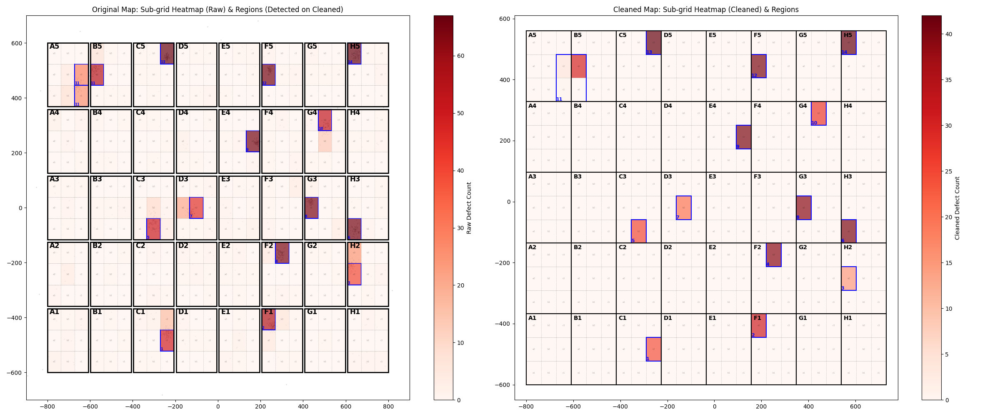

# Grid Map Analysis Final Report

## Overview
This report summarizes the analysis of defect patterns on the panel grid. The analysis includes gap removal, sub-grid defect counting, noise removal, and region detection.
Regions are detected based on the **Cleaned Defect Counts** (after noise removal).

## Visualization

- **Left**: Original Map showing Raw Defect Counts. Blue boxes indicate regions detected on the *Cleaned* data.
- **Right**: Cleaned Map showing Cleaned Defect Counts (Noise Removed). Blue boxes indicate the same regions.

## Detected Regions (High Defect Density)
| Region ID | Total Defects (Cleaned) | Sub-grid Count | Avg Defects/Grid | Sub-grids |
|---|---|---|---|---|
| 14 | 42 | 1 | 42.00 | ['H5-a3'] |
| 13 | 42 | 1 | 42.00 | ['C5-c3'] |
| 9 | 40 | 1 | 40.00 | ['E4-c2'] |
| 12 | 40 | 1 | 40.00 | ['F5-a2'] |
| 6 | 40 | 1 | 40.00 | ['H3-a1'] |
| 8 | 39 | 1 | 39.00 | ['G3-a2'] |
| 4 | 39 | 1 | 39.00 | ['F2-b3'] |
| 11 | 35 | 3 | 11.67 | ['A5-c1', 'A5-c2', 'B5-a2'] |
| 2 | 31 | 1 | 31.00 | ['F1-a3'] |
| 10 | 27 | 1 | 27.00 | ['G4-b3'] |
| 5 | 25 | 1 | 25.00 | ['C3-b1'] |
| 1 | 24 | 1 | 24.00 | ['C1-c2'] |
| 7 | 20 | 1 | 20.00 | ['D3-b2'] |
| 3 | 15 | 1 | 15.00 | ['H2-a2'] |
